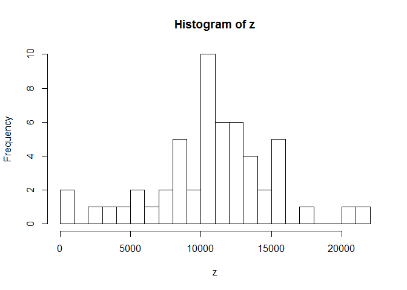
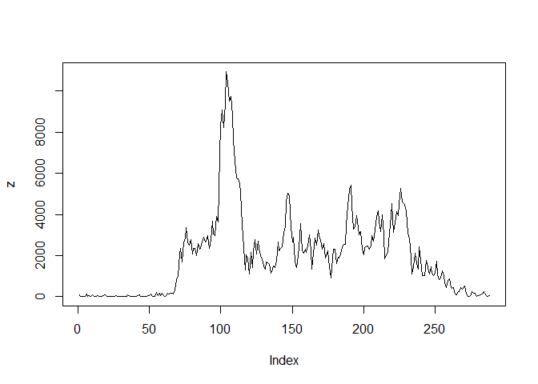
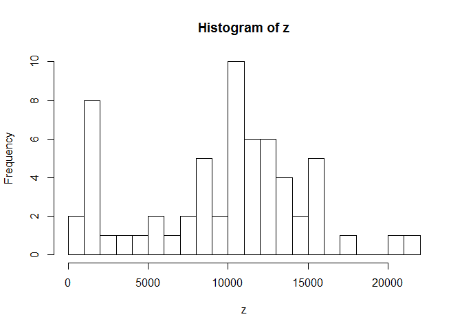
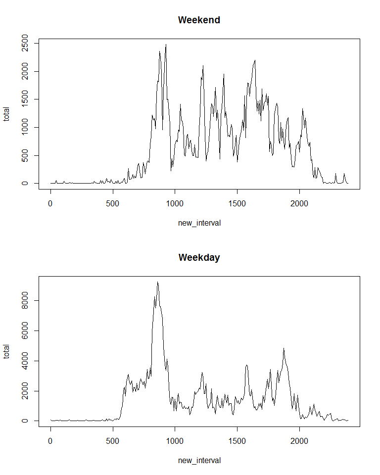

# Reproducible Research: Peer Assessment 1


## Loading and preprocessing the data

```r
library(plyr)
```

```
## Warning: package 'plyr' was built under R version 3.1.3
```

```r
library(timeDate)
```

```
## Warning: package 'timeDate' was built under R version 3.1.3
```

```r
activity<-read.csv(unz('activity.zip','activity.csv'))
activity_clean<-activity[complete.cases(activity),]
temp<-write.csv(activity_clean,'clean_activity.csv')
activity_clean<-read.csv('clean_activity.csv',row.names=1)
```

## What is mean total number of steps taken per day?

The histogram of activity is below

```r
z<-tapply(activity_clean$steps,activity_clean$date,sum)
hist(z,20,freq=TRUE)
```

 

The Mean of the number of steps is below

```r
mean(z)
```

```
## [1] 10766.19
```

Median is:

```r
median(z)
```

```
## [1] 10765
```
## What is the average daily activity pattern?

The activity pattern looks as follows:

```r
z<-tapply(activity_clean$steps,activity_clean$interval,sum)
plot(z,type='l')
```

 

The most active 5 minute interval on average is:

```r
names(which.max(z))
```

```
## [1] "835"
```


## Imputing missing values

We compute the missing values based on the median data. The number of missing values are:

```r
sum(is.na(activity$steps))
```

```
## [1] 2304
```

We store the median from the clean data source for the 5 minute interval and look up as necessary.

```r
z<-tapply(activity_clean$steps,activity_clean$interval,median)
activity_patch<-ddply(activity,.(date,interval),mutate,new_steps=if(is.na(steps)) as.numeric(z[toString(interval)]) else steps)
z<-tapply(activity_patch$new_steps,activity_patch$date,sum)
hist(z,20,freq=TRUE)
```

 

Mean is

```r
mean(z)
```

```
## [1] 9503.869
```

Median is

```r
median(z)
```

```
## [1] 10395
```

## Are there differences in activity patterns between weekdays and weekends?

```r
activity_alldays<-ddply(activity_patch,.(date,interval),mutate,weekdayinfo= isWeekday(as.Date(date)))
activity_alldays<-ddply(activity_alldays,.(date,interval),mutate,new_interval= interval %/% 100 * 100 + ((interval %% 100)/60*100))
activity_weekdays<-ddply(activity_alldays,.(new_interval,weekdayinfo),summarize,total=sum(new_steps))
```

Plot is below. There are differences in activity patterns. As you can wee there are more steps in weekend than on weekdays.


```r
par(mfrow=c(2,1))
plot(activity_weekdays[activity_weekdays$weekdayinfo==FALSE,][,c("new_interval","total")], main="Weekend")
plot(activity_weekdays[activity_weekdays$weekdayinfo==TRUE,][,c("new_interval","total")], main="Weekday")
```

 
